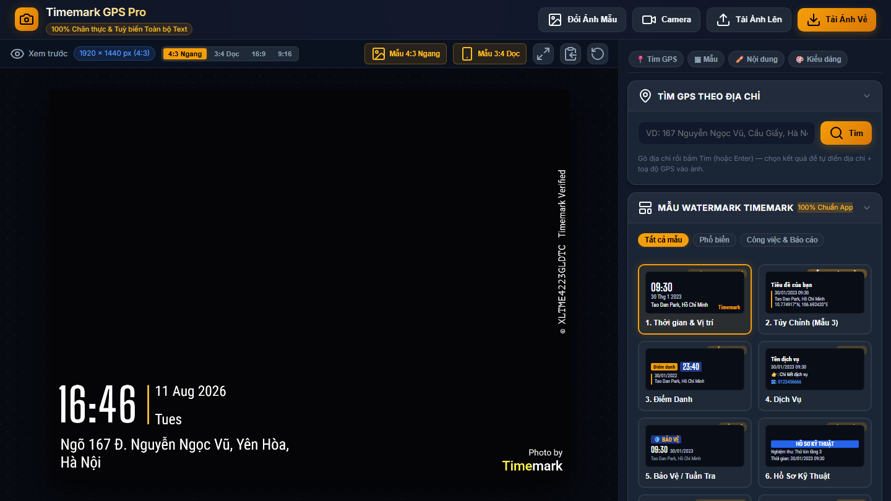

# 📸 Timemark GPS Pro — Đóng Dấu Toạ Độ & Thời Gian Lên Ảnh

[](https://phongvan0926.github.io/watermark/)
[](tests/ui-test.js)
[](#-kiến-trúc)

Công cụ web đóng dấu **ngày giờ + địa chỉ + toạ độ GPS + mã xác thực** lên ảnh, tái tạo chuẩn xác phong cách app **Timemark: Photo Proof for Work** và GPS Map Camera — chạy 100% trên trình duyệt, không cần cài đặt, ảnh không bao giờ rời khỏi máy bạn.

**👉 Dùng ngay: https://phongvan0926.github.io/watermark/**



## ✨ Tính năng

- **12 mẫu watermark chuẩn catalog Timemark**: Thời gian & Vị trí, Tùy chỉnh, Điểm danh, Dịch vụ, Bảo vệ/Tuần tra, Hồ sơ kỹ thuật, Đã hoàn thành, Nhật ký công việc, GPS & Thời tiết, Toạ độ ±ft, GPS Camera đa dòng, Báo cáo hiện trường.
- **Font chuẩn 100% như app gốc** — xác định bằng phương pháp đo IoU pixel trên ảnh mẫu thật (không đoán mò): đồng hồ `Big Shoulders Display 600`, chữ `Roboto Condensed`, logo `Roboto` hai tông màu, mã dọc `PT Mono`. Chi tiết trong [AGENTS.md](AGENTS.md).
- **📍 Tìm GPS theo địa chỉ**: gõ địa chỉ bất kỳ → tự tra toạ độ (OpenStreetMap Nominatim) → một cú bấm điền địa chỉ + toạ độ vào ảnh.
- **Đọc EXIF tự động**: tải ảnh lên là tự lấy ngày chụp gốc + toạ độ GPS trong ảnh (nếu có) và dịch ngược thành địa chỉ tiếng Việt.
- **Chụp trực tiếp từ camera** với watermark xem trước theo thời gian thực.
- **Xử lý hàng loạt**: kéo thả nhiều ảnh, tải về cả gói ZIP.
- **Tuỳ biến toàn bộ**: mọi dòng chữ, 4 vị trí góc, cỡ chữ, lề, màu sắc, bóng đổ, độ trong suốt; hỗ trợ 4 tỷ lệ khung 4:3 / 3:4 / 16:9 / 9:16 với độ chính xác pixel trên mọi độ phân giải (720p → 12MP).
- **Riêng tư tuyệt đối**: mọi xử lý ảnh diễn ra trong trình duyệt (Canvas API) — không upload ảnh lên bất kỳ máy chủ nào.

## 🚀 Sử dụng

**Cách 1 — Trên web (khuyến nghị):** mở https://phongvan0926.github.io/watermark/

**Cách 2 — Chạy cục bộ:** tải mã nguồn về và mở thẳng file `index.html` bằng trình duyệt. Không cần Node.js, không cần build. (Cần mạng ở lần mở đầu để tải Google Fonts.)

```bash
git clone https://github.com/phongvan0926/watermark.git
cd watermark
# mở index.html bằng trình duyệt là xong
```

## 🏗 Kiến trúc

Zero-Dependency thuần HTML5 / CSS / JavaScript ES6+ — không framework, không bundler:

```
├── index.html              # Giao diện chính
├── css/style.css           # Dark glassmorphism UI
├── js/
│   ├── watermark-engine.js # Lõi vẽ Canvas 2D — 12 mẫu, hằng số layout đo từ ảnh thật
│   ├── exif-parser.js      # Đọc EXIF nhị phân (ngày chụp, GPS) không thư viện
│   ├── geocoding.js        # Định vị, tra địa chỉ xuôi/ngược (Nominatim), mã bảo mật
│   ├── camera.js           # Camera trực tiếp + overlay watermark realtime
│   └── app.js              # State controller, đồng bộ 2 chiều UI ⟷ state
├── tests/ui-test.js        # 55 kiểm thử Playwright (UI reachability, geocode, camera)
└── AGENTS.md               # Tài liệu kỹ thuật đầy đủ + changelog cho AI agents
```

## 🧪 Kiểm thử

```bash
cd tests
npm install
npx playwright install chromium
node ui-test.js   # 55/55 PASS
```

Bộ test kiểm tra: mọi nút bấm được trên 4 kích thước màn hình, 12 mẫu × 4 vị trí không lỗi, accordion/điều hướng, trọn luồng tìm GPS theo địa chỉ (mock API), và chụp camera giả lập đầu-cuối.

## 📖 Tài liệu kỹ thuật

Toàn bộ công thức scale, hệ toạ độ đơn vị, bảng thông số đo đạc từ ảnh mẫu thật và nhật ký thay đổi chi tiết nằm trong [AGENTS.md](AGENTS.md).

---

*Ứng dụng phục vụ mục đích ghi chú thời gian/vị trí minh bạch cho ảnh công việc. Người dùng tự chịu trách nhiệm về nội dung đóng dấu.*
