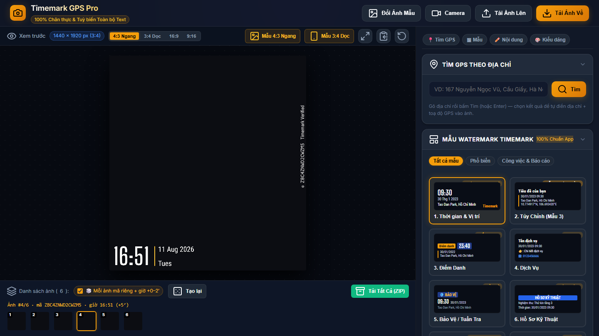

# 📸 Timemark GPS Pro — Đóng Dấu Toạ Độ & Thời Gian Lên Ảnh

[](https://phongvan0926.github.io/watermark/)
[](#-kiểm-thử)
[](#-kiến-trúc)
[](AGENTS.md#7-nhật-ký-thay-đổi-changelog)

Công cụ web đóng dấu **ngày giờ + địa chỉ + toạ độ GPS + mã xác thực** lên ảnh, tái tạo chuẩn xác phong cách app **Timemark: Photo Proof for Work** và GPS Map Camera — chạy 100% trên trình duyệt, không cần cài đặt, ảnh không bao giờ rời khỏi máy bạn.

**👉 Dùng ngay: https://phongvan0926.github.io/watermark/**


## ✨ Tính năng

- **12 mẫu watermark chuẩn catalog Timemark**: Thời gian & Vị trí, Tùy chỉnh, Điểm danh, Dịch vụ, Bảo vệ/Tuần tra, Hồ sơ kỹ thuật, Đã hoàn thành, Nhật ký công việc, GPS & Thời tiết, Toạ độ ±ft, GPS Camera đa dòng, Báo cáo hiện trường.
- **Font chuẩn 100% như app gốc** — xác định bằng phương pháp đo IoU pixel trên ảnh mẫu thật (không đoán mò): đồng hồ `Big Shoulders Display 600`, chữ `Roboto Condensed`, logo `Roboto` hai tông màu, mã dọc `PT Mono`. Chi tiết trong [AGENTS.md](AGENTS.md).
- **📍 Tìm GPS theo địa chỉ**: gõ địa chỉ bất kỳ → tự tra toạ độ → một cú bấm điền địa chỉ + toạ độ vào ảnh. Dùng **2 nguồn OpenStreetMap dự phòng lẫn nhau** (Nominatim → Photon), nên vẫn chạy được khi một máy chủ bị nhà mạng chặn.
- **Đọc EXIF tự động**: tải ảnh lên là tự lấy ngày chụp gốc + toạ độ GPS trong ảnh (nếu có) và dịch ngược thành địa chỉ tiếng Việt.
- **Chụp trực tiếp từ camera** với watermark xem trước theo thời gian thực.
- **Xử lý hàng loạt thông minh**: kéo thả nhiều ảnh, tải về cả gói ZIP — **mỗi ảnh tự nhận một mã xác thực riêng duy nhất** và **giờ lệch nhẹ** (ảnh sau cộng dồn ngẫu nhiên 0/1/2 phút), mọi thông tin khác giữ nguyên. Bật/tắt và tạo lại toàn bộ chỉ bằng một nút.
- **Không bao giờ mất dữ liệu**: địa chỉ, toạ độ, giờ bạn đã nhập (hoặc lấy từ GPS/EXIF) được giữ nguyên khi đổi sang mẫu watermark khác — chỉ những ô còn trống mới nhận nội dung minh hoạ.
- **Tuỳ biến toàn bộ**: mọi dòng chữ, 4 vị trí góc, cỡ chữ, lề, màu sắc, bóng đổ, độ trong suốt; hỗ trợ 4 tỷ lệ khung 4:3 / 3:4 / 16:9 / 9:16 với độ chính xác pixel trên mọi độ phân giải (720p → 12MP).
- **Giao diện gọn gàng**: thanh điều hướng nhanh dính trên đầu, các khối thu gọn/mở rộng được, cuộn tới mọi nút trên cả màn hình laptop thấp lẫn điện thoại.
- **Riêng tư tuyệt đối**: mọi xử lý ảnh diễn ra trong trình duyệt (Canvas API) — không upload ảnh lên bất kỳ máy chủ nào.



## 🦙 Công Cụ Bổ Trợ: Xoá Watermark & Vật Thể Bằng AI (`lama-cleaner/`)

Dự án tích hợp sẵn ứng dụng AI **LaMa Inpainting Studio** nằm trong thư mục con `lama-cleaner/` chuyên dùng để xoá watermark ngày giờ, toạ độ hoặc chi tiết thừa và tái tạo nền ảnh nguyên bản bằng mạng học sâu **Big-LaMa (Fast Fourier Convolutions)**:
- **Khởi chạy 1-click:** Nhấp đúp vào `run_lama_ui.bat` ở thư mục gốc (hoặc `lama-cleaner/run.bat`). Trình duyệt sẽ mở tại `http://localhost:7860`.
- **Nút chọn nhanh (1-Click Presets):** Tự động phủ kín vùng watermark ở góc dưới trái (Timemark, GPS Pro), góc dưới phải, cả viền đáy, hoặc góc trên.
- **Lossless Composite:** Vùng ảnh không có watermark được bảo toàn 100% độ sắc nét nguyên bản, không bị nén mờ hay biến dạng.
- **Thanh trượt Before / After & Nút xem ảnh gốc:** Kéo so sánh mượt mà từng pixel giữa ảnh gốc và ảnh sau khi xoá watermark.

## 🚀 Sử dụng

**Cách 1 — Trên web (khuyến nghị):** mở https://phongvan0926.github.io/watermark/

**Cách 2 — Chạy cục bộ:** tải mã nguồn về và mở thẳng file `index.html` bằng trình duyệt. Không cần Node.js, không cần build. (Cần mạng ở lần mở đầu để tải Google Fonts.)

```bash
git clone https://github.com/phongvan0926/watermark.git
cd watermark
# mở index.html bằng trình duyệt là xong
```

## 🏗 Kiến trúc

Zero-Dependency thuần HTML5 / CSS / JavaScript ES6+ cho ứng dụng chính, kết hợp thư mục con AI độc lập:

```
├── index.html                  # Giao diện chính Timemark
├── run_lama_ui.bat             # Launcher mở LaMa Inpainting Studio
├── css/style.css               # Dark glassmorphism UI Timemark
├── js/
│   ├── watermark-engine.js     # Lõi vẽ Canvas 2D — 12 mẫu, hằng số layout đo từ ảnh thật
│   ├── exif-parser.js          # Đọc EXIF nhị phân (ngày chụp, GPS) không thư viện
│   ├── geocoding.js            # Định vị, tra địa chỉ xuôi/ngược 2 nguồn (Nominatim+Photon), sinh mã, cộng giờ
│   ├── camera.js               # Camera trực tiếp + overlay watermark realtime
│   └── app.js                  # State controller, đồng bộ 2 chiều UI ⟷ state, biến thể batch
├── lama-cleaner/               # Ứng dụng AI xoá watermark & vật thể (Big-LaMa Inpainting)
│   ├── webui/                  # Giao diện Canvas Studio
│   ├── engine.py               # Lõi AI inference PyTorch
│   ├── server.py               # Server HTTP đa luồng (cổng 7860)
│   ├── run.bat                 # Chạy 1-click nội bộ
│   └── tests/                  # Test tự động
├── tests/                      # Test Playwright cho app Timemark chính
├── .github/workflows/          # Tự động deploy GitHub Pages mỗi lần push
└── AGENTS.md                   # Tài liệu kỹ thuật đầy đủ + changelog cho AI agents
```

## 🧪 Kiểm thử

```bash
cd tests
npm install
npx playwright install chromium
node ui-test.js         # 67/67 — UI, reachability, geocode + dự phòng, giữ dữ liệu khi đổi mẫu
node batch-test.js      # 11/11 — mỗi ảnh mã & giờ riêng khi tải hàng loạt
node vert-code-test.js  #  8/8  — định dạng mã xác thực
```

Bộ test kiểm tra: mọi nút bấm được trên 4 kích thước màn hình, 12 mẫu × 4 vị trí không lỗi, accordion/điều hướng, trọn luồng tìm GPS theo địa chỉ (mock API), chụp camera giả lập đầu-cuối, loạt tải hàng loạt (mỗi ảnh mã duy nhất + giờ cộng dồn 0–2′), cơ chế tự chuyển nhà cung cấp geocoding khi nguồn chính bị chặn, và việc giữ nguyên dữ liệu người dùng khi đổi mẫu.

## 📖 Tài liệu kỹ thuật

Toàn bộ công thức scale, hệ toạ độ đơn vị, bảng thông số đo đạc từ ảnh mẫu thật và nhật ký thay đổi chi tiết nằm trong [AGENTS.md](AGENTS.md).

## ⚠️ Về mã xác thực dọc mép phải

Mã 14 ký tự ở mép phải là **con tem trang trí khớp định dạng** của app gốc (14 ký tự, chữ hoa + số, dùng bảng chữ không nhầm lẫn — không có `0`, `O`, `1`, `I` — đúc kết từ phân tích ảnh mẫu thật). Nó **không phải** token do máy chủ Timemark cấp và **không tra cứu "Verified" được** trên hệ thống của họ. App chủ ý không mạo nhận mã thật.

---

*Ứng dụng phục vụ mục đích ghi chú thời gian/vị trí minh bạch cho ảnh công việc. Người dùng tự chịu trách nhiệm về nội dung đóng dấu.*
